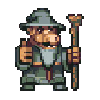

#  The Legend Of Alf

UTN - Facultad Regional Buenos Aires - Materia Paradigmas de Programación

## Equipo de desarrollo: 

- Dante Ezequiel Samudio (SamDante)
- Joaquin Mariosa Rendon (JoaquinMariosa)
- Leandro Leones (LeandroLeones)
- Pablo La Rocca (Pabloutndev) 
- Gonza Galarza (GonzaGalarza)
## Capturas 

## Reglas de Juego / Instrucciones

- Esta basado en The Legend of Zelda. Existen enemigos que se pueden atacar objetos para obtener y un jefe final para derrotar. 
- Alf tiene una cierta cantidad de vida que puede ir variando a lo largo de la partida.
- Hay dos mapas para recorrer: uno principal (la superficie) y una dungeon.
- Alf cuenta con un arma con la cual puede realizar daño a los enemigos que encuentre en su camino.

## Controles:

- Las flechas para moverse
- `Z` para atacar
- `X` para agarrar items
- `E` para abrir puerta
- `A` para utilizar el primer item del inventario
- `S` para utilizar el segundo item del inventario
- `D` para utilizar el tercer item del inventario
