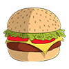

#  The Legend Of Alf

UTN - Facultad Regional Buenos Aires - Materia Paradigmas de Programación

## Equipo de desarrollo: 

- Dante Ezequiel Samudio (SamDante)
- Joaquin Mariosa Rendon (JoaquinMariosa)
- Leandro Leones (LeandroLeones)
- Pablo La Rocca (Pabloutndev) 
- Gonza Galarza (GonzaGalarza)

## Capturas 

## Reglas de Juego / Instrucciones

- Esta basado en The Legend of Zelda. Existen enemigos que se pueden atacar, objetos para obtener y un jefe final para derrotar.
- Para ganar el juego se tiene que derrotar al jefe final.
- Alf tiene una cierta cantidad de vida que puede ir variando a lo largo de la partida.
- Si Alf se queda sin vida se pierde el juego.
- Alf puede realizar ataques a una celda de distancia y potenciar los mismos mediante objetos como la espada, puede curarse mediante objetos como la hamburguesa y puede utilizar llaves tanto para abrir cofres como para abrir puertas
- Si colisionas con algun enemigo perdes vida.

## Controles:

- Las flechas para moverse
- `Z` para atacar
- `X` para agarrar items
- `C` para cambiar de habitacion
- `A` para utilizar el primer item del inventario
- `S` para utilizar el segundo item del inventario
- `D` para utilizar el tercer item del inventario

## Conceptos de materia aplicados:
- Clases: utilizamos clases para los Items, los Enemigos, las Puertas, las Habitaciones, entre otras mas.
- Polimorfismo: aplicamos polimorfismo a la hora de definir la accion que va a tener cada item, utilizando un metodo en comun para todos y cada uno de ellos define esta a su manera.
- Herencia: utilizamos herencia tanto en los items, para definir una superclase general (Items) y a partir de ahi se hereda en distintos tipos de items (ItemDeAlmacenamiento, ItemDeCuracion, etc.); y para el jefe el cual es un objeto particular que utiliza propiedades de la clase Enemigo, pero, como es unico y tiene comportamiento propio, se define un objeto como tal.
- Encapsulamiento: aplicamos encapsulamiento en las habitaciones para los diferentes elementos que tiene la misma, como su lista de puertas, enemigos e items; en inventarioHUD cuando utilizamos un item, ya que solo este conoce los items que Alf porta y puede usar.
- Composicion: aplicamos composicion en la clase Habitacion, ya que tienen una relacion con las puertas al estar conectadas a otras habitaciones para poder trasladar a Alf.
- Excepciones: utilizamos excepciones cuando el objeto interactuador no esta "sobre un item", devolviendo una excpecion con un mensaje.

## Diagrama de clases

